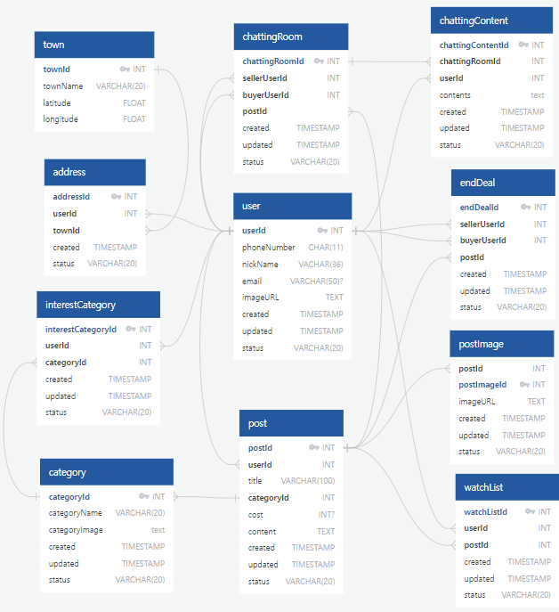

# CarrotMarket_test_Server_Skrr_Hoy

### 1. 기획서 작성

##### 개발 범위 설정

- 회원가입 / 로그인 화면
- 메인 홈 상품 리스트 화면
- 상품 디테일 화면
- 상품 등록 화면
- 나의 당근 화면
- 판매내역 화면
- 구매내역 화면
- 관심 목록 화면
- 동네 생활 화면
- 동네 생활 글 상세페이지
- 프로필
- 설정
- 채팅
- 채팅 상세페이지
   

##### 개발 우선순위 설정

1. 회원가입/ 로그인
2. 주소
3. 홈 화면
4. 상품 화면
5. 채팅
6. 나의 당근
7. 상품 추가
8. 프로필
9. 나의 당근
10. 앱 설정
11. 동네 생활
     

### 2. [ERD 설계](https://app.quickdatabasediagrams.com/#/d/YWyh7C)

- 거래 기능에 필수적인 테이블 구조 설계
- 크게 user 도메인과 post 도메인으로 분류
  

---

### 1. API 설계

- ERD 설계 내용을 바탕으로 API를 설계
  |Index|Method|URI|Description
  |:---:|:---:|:---:|:---:|
  |1|POST| /users| 회원가입|
  |2|GET| /address?search=| 주소 검색으로 찾기|
  |3|POST| /address/location| 현재 위치로 찾기|
  |4|POST| /users/login| 로그인 여부 확인|
  |5|GET| /users/townId| 유저가 설정한 동네 이름 가져오기|
  |6|GET| /address/range?userId=| 설정된 동네 범위 가져오기|
  |7|GET| /post/:range| 설정된 동네 범위로 게시글 조회|
  |8|GET| /postImage/titleImage?postId=| 게시물의 타이틀 이미지|
  |9|GET| /chatting/count?postId=| 게시물의 채팅 개수|
  |10|GET| /wishList/count?postId=| 게시물의 관심 목록 개수|
  |11|GET| /address/change| 주소 바꾸기|
  |12|GET| /myTown| 내 동네 조회 화면|
  |13|POST| /myTown/:addressId/status| 내 동네 설정 취소 버튼|
  |14|POST| /mytown/:addressId| 내 동네 설정 저장 버튼|
  |15|GET| /address/near?townId=| 특정 동네의 동네 리스트 반환|
  |16|POST| /address/range| 주소, 범위 저장 (내 동네 설정 저장)|
  |17|GET| /search?keyword=| 검색한 내용의 게시물 리스트|
  |18|GET| /category?categoryId=| 카테고리 별 게시물 리스트|
  |19|GET| /postImage?postId=| 특정 게시물 이미지 리스트 조회|
  |20|GET| /post/:userId| 유저 전체 게시물 조회|
  |21|GET| /post/:userId?sales=valid| 유저의 판매 내역 판매중 게시물 조회|
  |22|GET| /post?sellerUserId={userId}&sales=invalid| 유저의 판매 내역 거래완료 게시물 조회|
  |23|POST| /wishList/:{postId}| 관심 목록 추가|
  |24|GET| /chatting| 채팅창 리스트 조회|
  |25|GET| /chating/lastChat?chattingRoomId=| 각 채팅방 별 마지막 채팅 조회|
  |26|GET| /chatting/:chattingRoomId| 각 게시물 채팅 상세 조회|
  |27|GET| /users| 유저 정보 조회|
  |28|PATCH| /users| 유저 정보 수정|
  |29|POST| /address/admission?townName=| 동네 인증하기|
  |30|GET| /post?buyerUserId={userId}&sales=invalid| 유저의 구매 내역 거래완료 게시물 조회|
  |31|GET| /wishList| 관심 목록 조회|
  |32|GET| /category| 카테고리 조회|
  |33|POST| /category| 카테고리 변경 / 추가|
