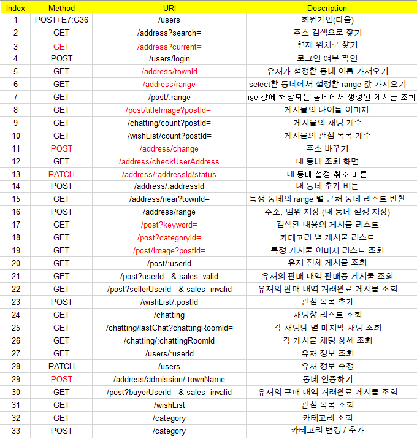
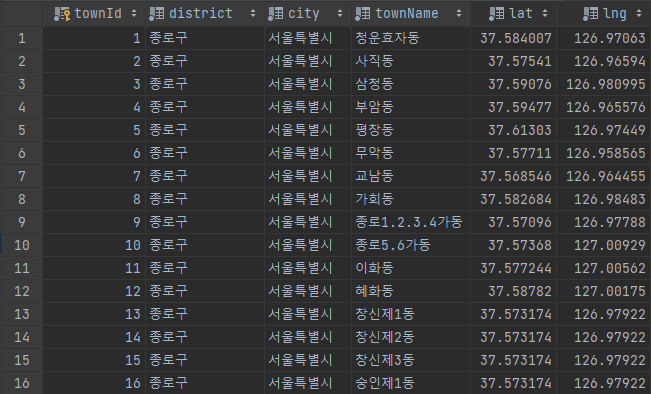
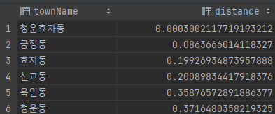

# CarrotMarket_test_Server_Skrr_Hoy


### 1. api 설계 수정

- domain 수정 및 메소드 수정
  

### 2. 서버 구축

1. EC2 서버 및 RDS 서버 구축
   <br>

2. 서울의 모든 행정구역(동) 별 대표 위도, 경도 데이터 추가
   

- 위도와 경도를 통해 가까운 동네 찾아내는 방법:

```
SELECT townName, ( 6371 * acos( cos( radians(?) ) * cos( radians( lat ) )
* cos( radians( lng ) - radians(?) ) + sin( radians(?) ) * sin( radians( lat ) ) ) ) AS distance
FROM Town
HAVING distance < 10
ORDER BY distance
LIMIT 0 , 6;
```

ex) 청운효자동과 거리가 10km 미만인 동네 중 5개의 동네 찾기

parameter에 순서대로 청운효자동의 lat, lng, lat 값을 삽입한다.
결과는 청운효자동을 포함한 6개의 동네를 출력한다.


